# 👁️ EyeGasto – Smart Expense Tracker

EyeGasto is a cozy modern and responsive **expense tracker web app** that helps users manage their money like a simple digital bank account.

Track expenses, monitor your balance, set daily budgets, and analyze your spending habits with interactive charts — all in one clean interface.

---

# 🚀 Live Demo

🔗 https://eye-gasto.vercel.app/

---

# 🖥️ Tech Stack

<p align="left">
  
  
  
  
  
</p>

---

# ✨ Features

## ✨ Cozy UI & Animations

- EyeGasto features a cozy and friendly interface with custom-made animations.  
The start card smoothly fades in to welcome users, shiny interactive buttons add a playful feel, and subtle UI animations appear each time the app opens to make the experience smooth, lively, and enjoyable.

## 💰 Balance / Savings System

- Add money to your balance  
- Withdraw money anytime  
- Real-time balance tracking  
- Transaction recording  

---

# 📊 Daily Budget Tracking

EyeGasto includes a **daily budget system**.

- Set your daily budget
- Expenses automatically deduct from the budget
- Deleting an expense refunds the budget
- Helps users stay within their spending limit

### Notifications

- ⚠ Budget running low  
- 🚨 Budget fully spent  

---

# ➕ Expense Management

### Add Expense
Create expenses with:

- Name  
- Amount  
- Category  

### Edit Expense
- Update existing expenses
- Data updates instantly

### Delete Expense
- Confirmation before deletion
- Budget auto-adjusts
- Error handling included

---

# 📂 Categories

- 🍔 Food  
- 🚗 Transport  
- 🛍 Shopping  
- 💡 Bills  
- 🏥 Health  
- 🎮 Entertainment  
- 📚 Education  
- 💰 Savings  
- 💳 Debt  
- 📦 Others  

Each category includes custom styling and icons.

---

# 📅 Expense Filters

Filter your expenses by:

- Today  
- Last 7 Days  
- All Time  

---

# 📈 Analytics Dashboard

The dashboard provides insights like:

- Total Expenses  
- Biggest Expense Today  
- Recent Transactions  
- Category Spending Chart  

Powered by **Chart.js**.

---

# 👋 Personalized Welcome System

EyeGasto includes a **Start Card Modal**.

### First Time Users
- Enter your name
- Receive a welcome message

### Returning Users
The app remembers the user and displays:

```
Welcome back, John 👋
```

This makes the experience more personal.

---

# 🔔 Smart Notifications

The system alerts users when:
- You've entered a budget for today
- Budget is low
- Budget is exhausted
- User logs in
- Welcome messages appear

---

# 🧾 Transactions History

Users can view transaction history filtered by:

- Today  
- Last 7 Days  
- All Time  

---

# 💾 Data Storage

Currently using **Local Storage**.

Stored data includes:

- User name
- Savings
- Expenses
- Budget
- Transactions

⚠ Clearing browser storage removes saved data.

Future updates may include a backend database.

---

# 📱 Responsive Design

EyeGasto works across:

- Desktop
- Tablet
- Mobile

Users can also install it using **Add to Home Screen**.

---

# 📷 Screenshots

## Desktop
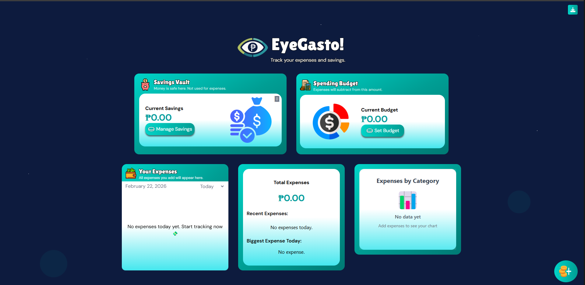
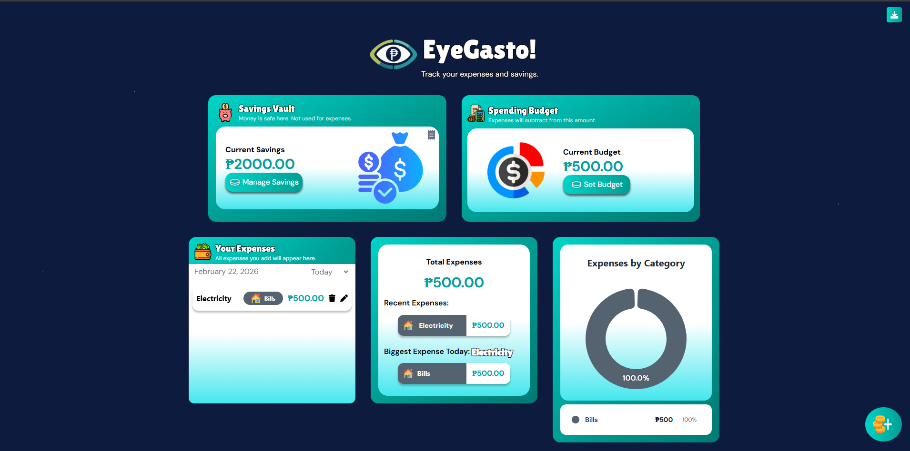

## Mobile
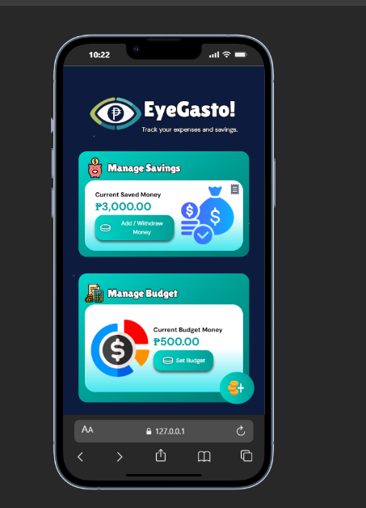
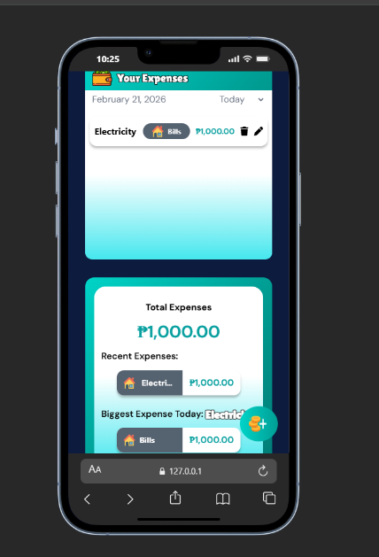
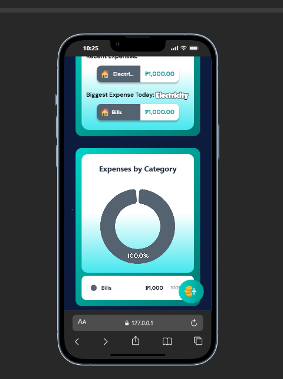

## Tablet
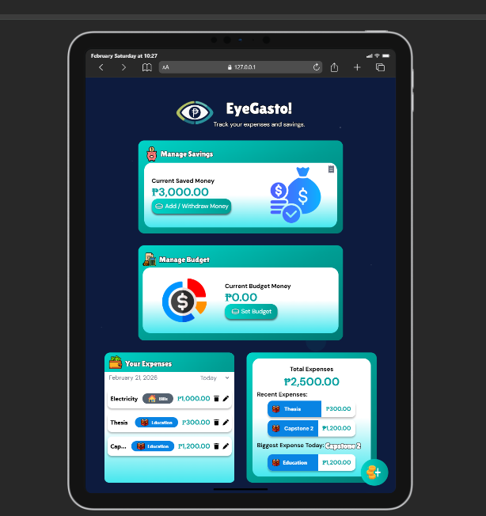

## Start Card
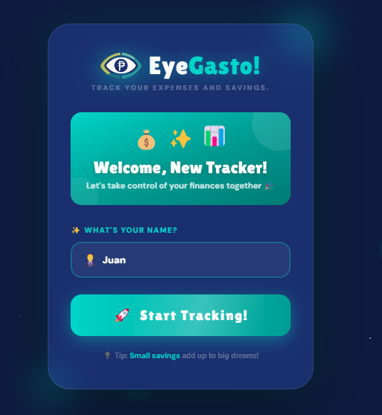

## Notifications
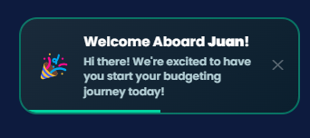

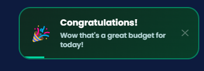

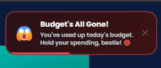

## Tooltip
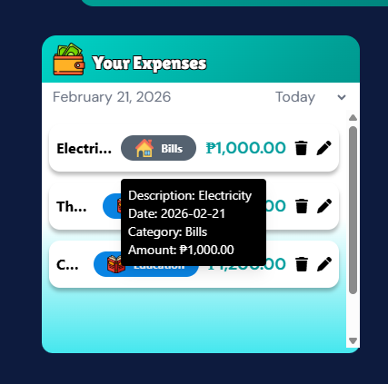

## Confirmation (Error Handling)
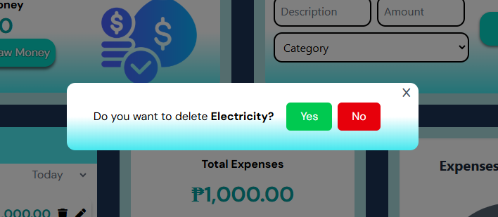

## Add Expense and Edit Expense (Error Handling)
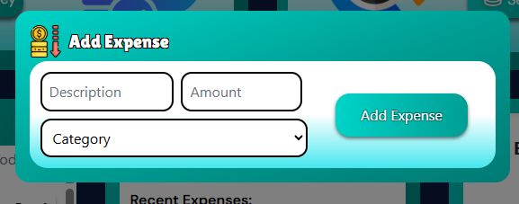
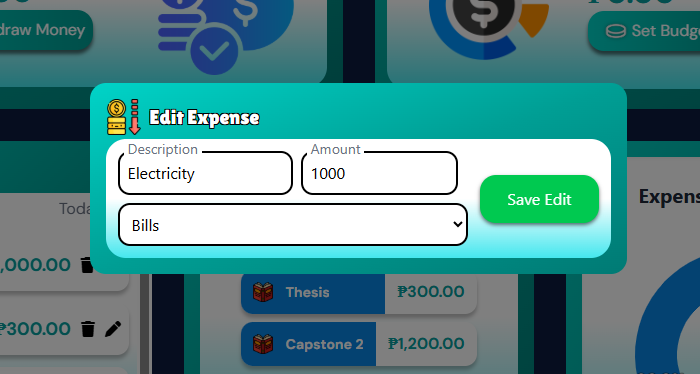

## Transactions
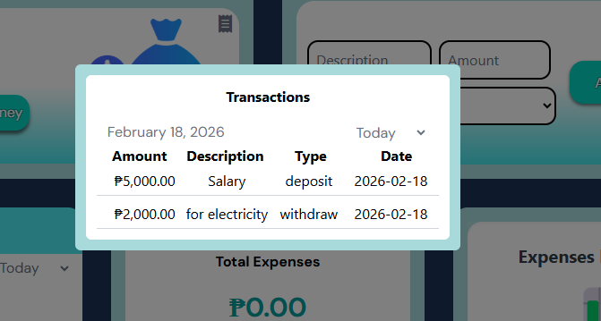

## Filters
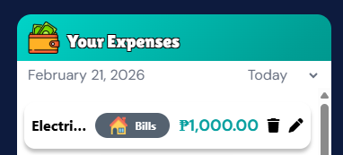
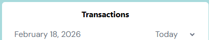

---

# 🧠 Purpose of This Project

This project was built to practice:

- JavaScript logic
- Financial tracking systems
- UI/UX design
- Chart data visualization
- Deploying a production-ready web app

---

# 🔮 Future Improvements

- Database integration
- User accounts
- Cloud sync
- Export reports
- Monthly budgets
- Dark mode
- Offline support (PWA)

---

# 📦 Installation

Clone the repository:

```bash
git clone https://github.com/your-username/eyegasto.git
```

Navigate into the folder:

```bash
cd eyegasto
```

Run locally:

Open `index.html` in your browser or use **Live Server**.

---

# 🌐 Deployment

The project is deployed using **Vercel**.

Steps:

1. Push project to GitHub
2. Import repository into Vercel
3. Deploy

---

# 👨‍💻 Author

Juan Miguel Austria (Tech1uan)

If you like this project, consider giving it a ⭐ on GitHub.
