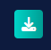

# 👁️ EyeGasto – Smart Expense Tracker

EyeGasto is a cozy modern and responsive **expense tracker web app** that helps users manage their money, track expenses, set daily budgets, and view spending insights — all in a clean and interactive interface.

---

# 🚀 Live Demo

🔗 https://eye-gasto.vercel.app/

---

# 🖥️ Tech Stack

<p align="left">
  
  
  
  
  
</p>

---

# ✨ Features

## 🏦 Budget & Balance Tracking
- Set a daily budget, track expenses, and monitor balance in real time  
- Automatic budget deduction and refunds when adding or deleting expenses  
- Notifications for low budget, budget fully spent, or **budget exceeded**  
- Original budget saved for accurate tracking  

## ➕ Expense Management
- Add, edit, and delete expenses with categories  
- Instant balance and budget updates  
- Confirmation prompts and error handling  

## 📊 Analytics Dashboard
- Category-wise spending charts and insights  
- Total expenses, biggest expense, and recent transactions  

## 👋 Personalized Welcome System
- First-time users enter their name and receive a welcome message  
- Returning users see **randomized greetings**, making the app feel smart and engaging  

## 🔔 Smart Notifications
- Alerts for budget status, overspending, and user greetings  
- Smooth animated notification cards

## 📄 Export Data as PDF *(New!)*
- Export your full **EyeGasto Data Report** as a downloadable PDF with one tap  
- Report includes:
  - 📌 Biggest expense of the day  
  - 🕐 Recent expenses  
  - 🗂️ Expenses broken down by category with percentage share  
  - 📅 Today's expenses and transactions  
  - 📆 This week's expenses and transactions  
  - 🗃️ All-time expenses and transactions  
- Each table includes a **total row** for quick reference  
- Auto-generated with the current date and page numbers  


## 💾 Data Storage
- User name, savings, expenses, budgets, and transactions stored in Local Storage  
- Data persists across sessions  

## 📱 Responsive Design
- Works on desktop, tablet, and mobile  
- Add to Home Screen (PWA-friendly)

### Budget Visualization

- The app dynamically highlights the current budget in **green** when funds are available.
- When the budget reaches **0 or goes below zero**, the budget amount turns **red**.
- This provides instant visual feedback to help users track overspending and manage their expenses effectively.
---

# 📂 Expense Categories

- 🍔 Food  
- 🚗 Transport  
- 🛍 Shopping  
- 💡 Bills  
- 🏥 Health  
- 🎮 Entertainment  
- 📚 Education  
- 💰 Savings  
- 💳 Debt  
- 📦 Others  

---

# 📅 Expense Filters
- Filter transactions by **Today**, **Last 7 Days**, or **All Time**

---

# 📷 Screenshots

## Dashboard


## Mobile


## Tablet


## Start Card


## Notifications


## Add/Edit Expenses & Confirmation


## Transactions & Filters


## Export Data as PDF



---

# 🧠 Purpose of This Project

- Practice JavaScript logic and financial tracking systems  
- Learn UI/UX design and interactive animations  
- Work with chart data visualization using Chart.js  
- Build and deploy a production-ready web app  

---

# 🔮 Future Improvements

- Database & user accounts  
- Cloud sync & offline support (PWA)  
- Export reports & monthly budgets  
- Dark mode  

---

# 📦 Installation

```bash
git clone https://github.com/your-username/eyegasto.git
cd eyegasto

# 📦 Installation

Clone the repository:

```bash
git clone https://github.com/your-username/eyegasto.git
```

Navigate into the folder:

```bash
cd eyegasto
```

Run locally:

Open `index.html` in your browser or use **Live Server**.

---

# 🌐 Deployment

The project is deployed using **Vercel**.

Steps:

1. Push project to GitHub
2. Import repository into Vercel
3. Deploy

---

# 👨‍💻 Author

Juan Miguel Austria (Tech1uan)

If you like this project, consider giving it a ⭐ on GitHub.
